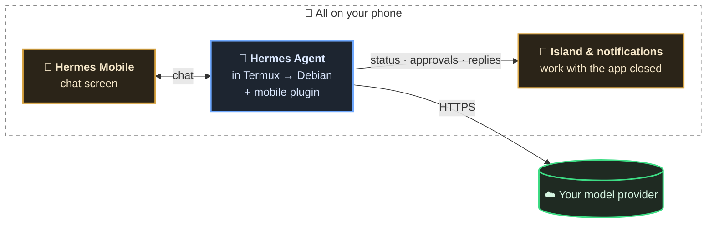

<p align="center">
  
</p>

<p align="center">
  <b>A native-feeling Android app for <a href="https://github.com/NousResearch/hermes-agent">Hermes Agent</a>, running entirely on your phone.</b><br>
  No laptop. No server.
</p>

<p align="center">
  
  
  
  
  
</p>

<p align="center">
  <a href="https://x.com/markkeeper2/status/2106873833978540280"></a><br>
  <a href="https://x.com/markkeeper2/status/2106873833978540280"><b>𝕏 See the demo release post</b></a>
</p>

> Unofficial community project. Not affiliated with or endorsed by Nous Research.

## Why

Hermes Agent is a powerful agent, but it lives in a terminal. Hermes Mobile gives it a proper phone interface: streaming chat,
live tool cards, approvals you can answer from the status bar, a canvas for building things together, and notifications that work
while the app is closed. Hermes runs in Termux on the same phone, so the whole thing is self-contained.

## Highlights

### Answer from the island

Approvals and questions show up on the status chip (an Android 16 Live Update; older versions get a normal notification).
One tap on the chip, pick an answer, done. The app does not need to be open.

<p align="center"></p>

### Renders everything, natively

KaTeX equations, sortable tables with "Copy table", tick-able task lists, Obsidian-style callouts, Mermaid diagrams (full screen,
pinch to zoom), coloured diffs, long code that collapses, inline SVG and HTML cards.

<p align="center"></p>

### A canvas you and Hermes share

Ask for an interactive page or a 3D scene and Hermes builds it live in a document beside the chat. HTML runs in a sandbox that is offline
unless you allow it. Every change is a version with a diff you can restore.

<p align="center"></p>

### Your phone's assistant

Pick Hermes under Default apps → Digital assistant app and long-pressing the power button (or the assist gesture) opens it straight
in hands-free Live mode. Settings → Voice shows whether it is on.

<p align="center"></p>

### Your chats, your memory, your look

Search inside every message, pin, archive, link chats to chats. Every memory write is shown as a diff, and there is a screen to see
what Hermes remembers. Dark, OLED black or light.

<p align="center"></p>

### And more

| | |
|---|---|
| **Voice** | Read replies aloud with a player (pause, seek, speed, any installed speech engine), dictation, hands-free Live mode, and Hermes as your phone's assistant |
| **Control a turn** | Stop or steer a running reply, edit, retry or branch any turn, and `/btw` to ask a side question without interrupting |
| **See the work** | Live tool cards (long runs fold into one line), sub-agents, the to-do list, speed and context use per reply, and file checkpoints to undo Hermes's file changes |
| **Skills & commands** | `/` autocomplete for every skill and slash command |
| **Models & profiles** | Switch model and reasoning level per chat; create, clone and edit profiles with their own default model, keys and SOUL.md |
| **Notifications** | Reply, answer questions and allow commands right from the notification; cron results; a "failed" note when a model call fails |
| **Cron & files** | Cron jobs (edit, run, results), a file browser and projects |
| **Share** | "Share to Hermes" from any app; attach photos, camera shots and files; share a chat as Markdown; link chats to each other |
| **Offline-friendly** | Messages typed offline send on reconnect; the last chat list is cached |
| **Shortcuts & big screens** | Launcher shortcuts (New chat, Live mode, last chat); a two-column layout on tablets and foldables |
| **Setup check** | One screen that checks Termux, permissions, the plugin and battery settings, with a fix button for each |
| **Battery** | No permanent wake lock: the phone sleeps while Hermes is idle |

## How it fits together



Hermes runs in Termux on the phone, and the app talks to it over localhost the same way Hermes Desktop does (it also starts Hermes
when it isn't running). A small Hermes plugin sends status, approvals and replies to the app's background service, so the island
chip and notifications work even when the app is closed.

## Install

You need an Android phone (arm64, Android 8+) with about 6 GB free, and access to a model, either of:

- **A subscription you already have:** ChatGPT Plus / Pro (or a Codex plan), Claude Pro / Max, SuperGrok / X Premium+, or a Nous
  Portal account. You sign in from the app.
- **An API key:** for example [OpenRouter](https://openrouter.ai/keys) (one key for every model), Anthropic, OpenAI or Gemini
  (has a free tier).

The install takes 15-40 minutes, mostly waiting.

### On the phone, no computer

1. Install **[Termux](https://f-droid.org/packages/com.termux/)** from F-Droid (not the Play Store version, it is outdated).
2. Open Termux and paste:

   ```bash
   curl -fsSL https://raw.githubusercontent.com/omarqaterge/hermes-mobile-app/main/phone/bootstrap.sh -o hm.sh && bash hm.sh
   ```

   Keep Termux open and the screen on until it prints `HMSETUP DONE`.
3. Download **hermes-mobile.apk** from the [latest release](https://github.com/omarqaterge/hermes-mobile-app/releases/latest), install it
   and open it.
4. The app opens on **Connect Hermes to a model**: sign in with your subscription or paste an API key, then pick the model new
   chats use. You can change all of this later in **Settings → Subscriptions & accounts / API keys / Default models**.

   ChatGPT, Grok and Nous Portal sign in inside the app. Claude opens Termux for its sign-in, because Hermes only allows that one
   from a terminal: open the link it shows, approve, and paste the code back into Termux.

### From a computer (Mac, Windows, Linux)

Turn on **USB debugging** on the phone (Settings → About phone → tap *Build number* 7 times, then Developer options → USB debugging),
plug it in and run:

```bash
# Mac / Linux
curl -fsSL https://raw.githubusercontent.com/omarqaterge/hermes-mobile-app/main/tools/setup-phone.sh -o setup-phone.sh && bash setup-phone.sh
```

```powershell
# Windows (PowerShell)
irm https://raw.githubusercontent.com/omarqaterge/hermes-mobile-app/main/tools/setup-phone.ps1 | iex
```

It installs everything on the phone, including the app. At the end it offers to set an API key; press Enter to skip it and connect a
subscription or key in the app instead.

**Stuck, or rather not do it yourself?** Give your AI coding agent (Claude Code, Codex, Cursor…) this prompt. It runs the same
script and fixes what goes wrong:

```text
Read https://raw.githubusercontent.com/omarqaterge/hermes-mobile-app/main/AGENT_INSTALL.md and follow it to set up Hermes on my Android phone.
```

> Tested end to end on a clean Android 15 emulator and piece by piece on a real phone, but not yet on a brand-new real phone.
> If something fails, please [open an issue](https://github.com/omarqaterge/hermes-mobile-app/issues).

### After installing

- Set **battery to Unrestricted** for *Hermes Mobile* and *Termux* (Xiaomi/HyperOS: also turn on *Autostart*), or Android may stop them.
- Keep the Termux notification: Hermes runs inside Termux.
- To start Hermes after a reboot, install **Termux:Boot** from F-Droid and open it once (the computer route does this for you).
- To update, run the same command again and install the newest APK.

### Optional: let Hermes use the phone itself

The app works without these. They decide how much of the phone Hermes itself can reach. No root needed.

- **Files** (`/sdcard`): run `termux-setup-storage` in Termux and allow it. Then restart Hermes (`~/bin/hermes-services`) so
  it sees the storage.
- **Battery, location, clipboard, notifications, SMS…** (`termux-*` commands): install
  **[Termux:API](https://f-droid.org/packages/com.termux.api/)** from F-Droid, then in Termux:

  ```bash
  pkg install -y termux-api
  ROOT=$PREFIX/var/lib/proot-distro/containers/debian/rootfs
  for f in $PREFIX/bin/termux-*; do ln -sf "$f" "$ROOT/usr/local/bin/"; done
  ```
- **Screen, taps, apps, logs** (`screencap`, `input`, `am`, `pm`, `dumpsys`, `logcat`): an app can't do these on a
  phone that isn't rooted. **[Shizuku](https://shizuku.rikka.app/)** gives Termux the same access adb has:
  1. Install Shizuku and start it with *Wireless debugging* (Android 11+, pair once), from a computer with
     `adb shell sh /sdcard/Android/data/moe.shizuku.privileged.api/start.sh`, or with root if the phone is rooted.
  2. In Shizuku, *Use Shizuku in terminal apps* → *Export files* to Download. In Termux (after `termux-setup-storage`):

     ```bash
     mkdir -p ~/bin && cp ~/storage/downloads/rish ~/storage/downloads/rish_shizuku.dex ~/bin/
     sed -i 's/"PKG"/"com.termux"/' ~/bin/rish && chmod 700 ~/bin/rish && chmod 400 ~/bin/rish_shizuku.dex
     ~/bin/rish -c id      # allow Termux in Shizuku; it should print uid=2000(shell)
     ```
  Hermes finds `~/bin/rish` by itself. Without root, **Shizuku stops on every reboot**: open it and start it again.

### If something goes wrong

Open **Settings → Setup check** in the app first: it shows what's missing, with a button for each fix.

| What you see | Fix |
|---|---|
| "Hermes is offline" for more than a minute | In Termux run `~/bin/hermes-services`, then tap Reconnect in the app |
| `[Process completed (signal 9)]` in Termux during the install | Android stopped it. Android 14+: Developer options → *Disable child process restrictions* (the computer route does this for you). Then run `bash hm.sh` again |
| The install stops with `HMSETUP FAIL <step>` | Read the error above it, fix it and run `bash hm.sh` again; finished parts are skipped. [AGENT_INSTALL.md](AGENT_INSTALL.md) lists the usual causes |
| No status chip, canvas or approvals | Run `bash hm.sh` again (it re-enables the plugin) |
| Everything stops after a while | Battery is restricted, see *After installing* |
| Hermes says Shizuku isn't running | The phone rebooted: open Shizuku and start it again |
| Hermes can't find `termux-battery-status` (or another `termux-*` command) | See *Optional: let Hermes use the phone itself* |

<details>
<summary><b>Everything it does, and how it works</b></summary>

**Chat:** streaming replies with Markdown, LaTeX, Mermaid diagrams (full screen, pinch to zoom), highlighted code (collapse, wrap,
copy, open in canvas), sortable tables, tick-able task lists, coloured diffs, and images, video and audio from Hermes. Reasoning, live
tool cards, sub-agent cards, the to-do list; approvals, questions and secret, sudo and one-time-code prompts; stop and steer a running
turn; edit, retry and branch a turn; `/` commands and skills; attach photos, camera shots and files; "Share to Hermes" from other apps;
per-chat drafts; messages typed offline are sent on reconnect; turn stats; file checkpoints; share a chat as Markdown.

**Voice:** read replies aloud (any installed speech engine, voice, speed, pitch), dictation, hands-free Live mode, and Hermes as your
phone's assistant.

**Canvas:** documents you and Hermes share per chat (Markdown, HTML, code, CSV, SVG, Mermaid…) with version history, diffs and restore;
HTML runs in an offline sandbox.

**Chats:** full-text search that jumps to the message, unread dots, rename, pin, archive, delete, swipe and drag to reorder or pin.

**Settings:** themes (dark, OLED black, light, system), text size, voice, subscription sign-ins (ChatGPT, Claude, Grok, Nous Portal), default model per
profile or for all, every API key and every Hermes option. Profiles: create, clone, rename, edit SOUL.md, delete. Screens for skills, memory, cron jobs, files and projects.

**In the background:** a pinned status notification that becomes an Android 16 Live Update while Hermes works, plus notifications for
replies, questions and approvals that you can answer without opening the app, learning, and cron results. There are no messaging-channel
(Telegram, Discord…) settings: this app is the only front end.

**How it works:** Hermes's dashboard runs on the phone at `127.0.0.1:9119` and exposes the `tui_gateway` JSON-RPC connection that Hermes
Desktop uses. The interface (React, in `web/`) uses Hermes's own client from `apps/shared`, copied into `web/vendor/hermes-shared` and
pinned in `.hermes-commit`. The Android part (`android/`) is a thin Java shell around a WebView that does what a web page can't:
notifications, starting Hermes through Termux's `RUN_COMMAND`, the photo picker and camera, shares, media streaming. The plugin
(`hermes-plugin/`) sends events to the app and serves the canvas and media; `phone/` has the scripts that keep Hermes running.
A few fixes to Hermes itself live in `hermes/patches` (applied by the installer, offered upstream; see `hermes/README.md`).

</details>

## Development

### Build the app yourself

You need **Node 20+**, **JDK 17** and the [Android command-line tools](https://developer.android.com/studio#command-line-tools-only)
(`sdkmanager "platforms;android-36" "build-tools;35.0.0"`). No Gradle:

```bash
git clone https://github.com/omarqaterge/hermes-mobile-app.git && cd hermes-mobile-app
(cd web && npm ci)
ANDROID_HOME=/path/to/android-sdk JAVA_HOME=/path/to/jdk-17 VERSION_NAME=1.0.0 VERSION_CODE=1 android/build.sh
adb install -r android/build/hermes-mobile.apk
```

The first build creates a signing key in `~/.android/hermes-mobile.keystore` (never commit it). A self-built app can't update the
downloaded one, because the keys differ: uninstall that first.

To work on the interface in a desktop browser: `adb forward tcp:9119 tcp:9119`, `python3 web/devserver.py`, open http://127.0.0.1:5180.

### Tests

- `cd web && npm test`: unit tests.
- `tools/web-e2e/run.sh`: the built interface in headless Chromium against a mock Hermes.
- `python3 tools/test_canvas.py`, `tools/test_media.py`, `tools/test_chat_search.py`, `tools/test_battery.py`: the plugin and phone scripts.
- `tools/java-check.sh`: compiles the Java shell without the Android SDK.
- `tools/test_hermes_patches.sh`: the Hermes patches apply to the pinned Hermes build and revert cleanly.
- `python3 tools/e2e.py`: end-to-end checks against a real phone.

GitHub Actions runs all of them except the last on every push.

### After a Hermes update

The app uses Hermes's internal protocol, which can change. Copy the phone's Hermes `apps/shared/src` into `web/vendor/hermes-shared`,
update `.hermes-commit` and `.hermes-version` (the `hermes --version` build string, e.g. `0.21.5+4582.gb8a8be1`), run `npm run typecheck` in `web/` and rebuild. Then bring `hermes/patches` along: `hermes/README.md` says how.
The app compares the phone's Hermes build with `.hermes-version`: if they differ it shows a notice once and a warning in Settings → About.
There is no "update Hermes" button on purpose: Hermes updates ship with an app release, after the app has been adapted to them.

## License and credits

MIT, see [LICENSE](LICENSE). `web/vendor/hermes-shared` is copied from [NousResearch/hermes-agent](https://github.com/NousResearch/hermes-agent)
(MIT, Copyright Nous Research), see [THIRD_PARTY.md](THIRD_PARTY.md). "Hermes" and the Hermes Agent name belong to their owners.
Contributions and bug reports are welcome, see [CONTRIBUTING.md](CONTRIBUTING.md).
